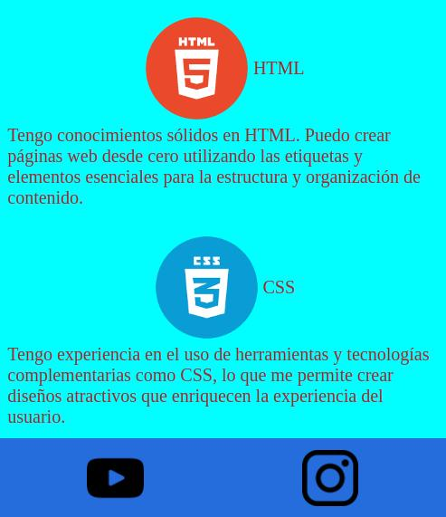

# Ejercicio 1

Para esta tarea vamos a poner en práctica los conceptos de selectores de CSS y de display flex.

Los pasos que debemos seguir para conseguir esta tarea, serán:

- Generar el HTML pertinente para cada ejemplo
- Generar el CSS pertinente para cada ejemplo
- Tratar de replicar los ejemplos mostrados
- Utilizar las imagenes dentro de images

Finalmente te invitamos a que una vez que lo hallas logrado, dejes volar tu creatividad y generes otros ejemplos por tu cuenta o trates de integrar los ejemplos antes mostrados.

## Enunciado
Basado en lo visto en clase crear debe darle estilo a el HTML "ejercicio_1.html". No necesita agregar nada al HTML para alcanzar el resultado deseado, debe lograrlo creando un archivo CSS, vincularlo al archivo HTML y realizar todas las reglas necesarias.

Ejemplo de lo que se requiere:




Recuerde que no es necesario que alcance un resultado 100% fial a la imagen.

__Ayuda:__ Recomendamos utilizar el siguiente estilo para el body:
```
body {
  height: 100%;
  width: 400px;
  display: flex;
  flex-direction: column;
}
```

¡El resto lo dejamos en sus manos!

Intente acercarse lo más posible. Recuerde crear los archivos necesarios(HTML & CSS) y vincular los archivos.