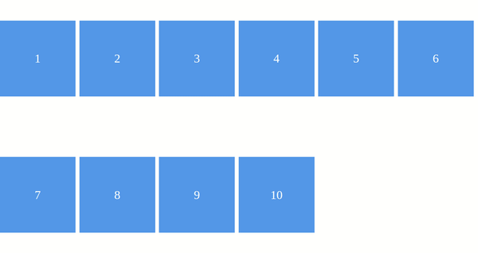

# Ejercicio de profundización

__NOTA:__ Se recuerda que los ejercicios de prfundización son para aquellas personas que puedan dedicarle más tiempo a practicar, son desafios extra. Lo idea es que puedan simpre completar primero los ejercicios de práctica y comprenderlos bien antes de hacer un ejercicio de profundización.

### Misión
Su misión, si decide aceptarla, es utilizar flex-wrap para generar un ejemplo de cajas como el siguiente:

- Deberá generar el HTML y css para este ejercicio.
- NO es neceario que se vea exactamente en esa distribución. Lo importante es que cree muchas cajas y que cuando el ancho de la pantalla se termina las cajas desborden a la fila siguiente de manera automática con flex-wrap

Si se anima, ¿Porqué no coloca algunos íconos divertidos dentro de cada caja?

Recuerde crear las carpetas asociadas (images, css), colocar las imagenes que utilizará en dicha carpeta y vincular los archivos.

La idea es que su sitio web refleje lo indicado en los ejemplos o parte del contenido (use su imaginación ^_^). No es necesario que sea 100% igual, ¡el objetivo es que practique y experimente!

### ¡Mucha suerte! ¡Cualquier duda nos consultan!